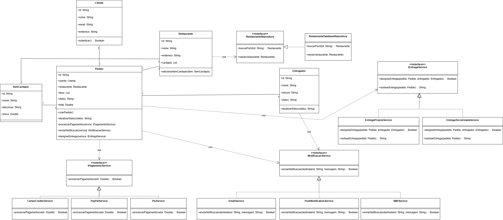

# 🍽 MesaExpress

## 📌 Sobre o Projeto

O **MesaExpress** é um sistema permite que clientes realizem pedidos em restaurantes cadastrados, escolham formas de pagamento, recebam notificações e acompanhem o processo de entrega.
Este projeto foi desenvolvido como atividade acadêmica para demonstrar conceitos de **engenharia de software, modelagem UML e boas práticas de arquitetura de sistemas**.

---

# 🎯 Objetivos do Sistema

O sistema **MesaExpress** tem como objetivo simular o funcionamento básico de uma plataforma de delivery, permitindo:

- Cadastro e autenticação de clientes
- Cadastro de restaurantes
- Visualização de cardápio
- Criação e gerenciamento de pedidos
- Processamento de pagamentos
- Designação de entregadores
- Rastreamento de entregas
- Envio de notificações aos usuários

---
## 📊 Diagrama de Classes

  

---

# 🧠 Aplicação dos Princípios SOLID

O projeto **MesaExpress** foi desenvolvido aplicando os princípios **SOLID**, que promovem boas práticas de design em sistemas orientados a objetos.

---

## S — Single Responsibility Principle

Cada classe possui uma única responsabilidade dentro do sistema.

Exemplos:

- Pedido → gerenciamento de pedidos
- PixService → processamento de pagamentos via Pix
- EmailService → envio de notificações por email

---

## O — Open/Closed Principle

O sistema é aberto para extensão, mas fechado para modificação.

Exemplo: novos métodos de pagamento podem ser adicionados implementando `IPagamentoService` sem alterar o código existente.

---

## L — Liskov Substitution Principle

Qualquer implementação de uma interface pode substituir outra sem alterar o comportamento esperado do sistema.

Exemplo:

- PixService
- PayPalService
- CartaoCreditoService

Todas podem ser utilizadas como `IPagamentoService`.

---

## I — Interface Segregation Principle

As interfaces são específicas para cada funcionalidade, evitando dependências desnecessárias.

Exemplo:

- IPagamentoService
- IEntregaService
- INotificacaoService

---

## D — Dependency Inversion Principle

As classes de alto nível dependem de **abstrações (interfaces)** e não de implementações concretas.

Exemplo:
