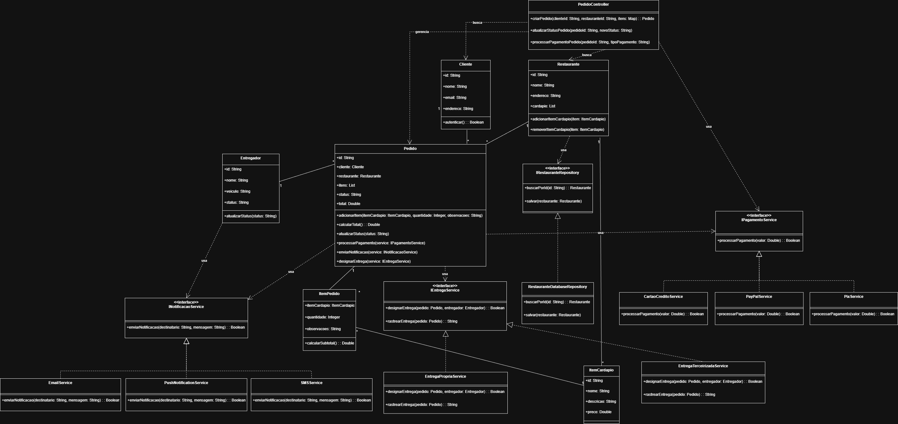

# 🍽 MesaExpress

## 📌 Sobre o Projeto

O **MesaExpress** é um sistema permite que clientes realizem pedidos em restaurantes cadastrados, escolham formas de pagamento, recebam notificações e acompanhem o processo de entrega.

---

# 🎯 Objetivos do Sistema

O sistema **MesaExpress** tem como objetivo simular o funcionamento básico de uma plataforma de delivery, permitindo:

- Cadastro e autenticação de clientes
- Cadastro de restaurantes
- Visualização de cardápio
- Criação e gerenciamento de pedidos
- Processamento de pagamentos
- Designação de entregadores
- Rastreamento de entregas
- Envio de notificações aos usuários

---
## 📊 Diagrama de Classes

  

---

# 🧠 Aplicação dos Princípios SOLID

O projeto **MesaExpress** foi desenvolvido aplicando os princípios **SOLID**, que promovem boas práticas de design em sistemas orientados a objetos.

---

## S — Single Responsibility Principle

Cada classe possui uma única responsabilidade dentro do sistema.

Exemplos:

- Pedido → gerenciamento de pedidos
---

## O — Open/Closed Principle

O sistema é aberto para extensão, mas fechado para modificação.

Exemplo: novos métodos de pagamento podem ser adicionados implementando `IPagamentoService` sem alterar o código existente.

---

## L — Liskov Substitution Principle

Qualquer implementação de uma interface pode substituir outra sem alterar o comportamento esperado do sistema.

Exemplo:

- PixService
- PayPalService
- CartaoCreditoService

Todas podem ser utilizadas como `IPagamentoService`.

---

## I — Interface Segregation Principle

As interfaces são específicas para cada funcionalidade, evitando dependências desnecessárias.

Exemplo:

- IPagamentoService
- IEntregaService
- INotificacaoService

---

## D — Dependency Inversion Principle

As classes de alto nível dependem de **abstrações (interfaces)** e não de implementações concretas.

---

# 🧩 Aplicação dos Princípios GRASP

O projeto **MesaExpress** também aplica princípios **GRASP**, auxiliando na organização das responsabilidades entre as classes do sistema.

---

## Controller

O princípio **Controller** foi aplicado em `PedidoController`, responsável por operações como criar pedido, atualizar status e processar pagamento.

---

## Information Expert

O princípio **Information Expert** foi aplicado em `Pedido`, que concentra informações para calcular total, atualizar status e gerenciar o pedido.

---

## Creator

O princípio **Creator** foi aplicado na relação entre `Pedido` e `ItemPedido`, pois o pedido agrupa e gerencia seus itens.

---

## Low Coupling e High Cohesion

Esses princípios foram aplicados com o uso de interfaces e com a separação de responsabilidades entre classes como `Pedido`, `Restaurante` e `Entregador`.

---

## Polymorphism

O princípio **Polymorphism** foi aplicado nas implementações de:

- `IPagamentoService`
- `INotificacaoService`
- `IEntregaService`

---

## Pure Fabrication

O princípio **Pure Fabrication** foi aplicado nas classes de serviço, como `PixService`, `EmailService` e `SMSService`.

---

## Indirection e Protected Variations

Esses princípios foram aplicados com o uso de interfaces, permitindo adicionar novas formas de pagamento, notificação e entrega sem alterar a estrutura principal do sistema.

---
